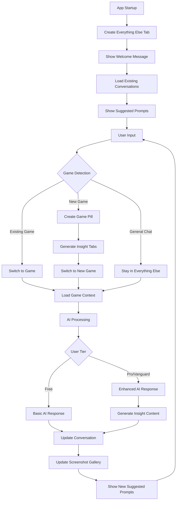
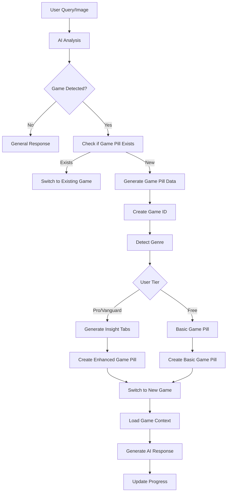

# 📋 **Otagon Chat Screen Enhancement - Complete Implementation Plan**

## **Overview**
This document outlines the complete implementation plan for enhancing the Otagon chat screen with persistent storage, screenshot gallery, context menu system, and all missing features from the old build. The plan is designed for step-by-step implementation with testing criteria for each feature.

---

## **Key Features Summary**

### **🔄 Automatic Chat Persistence**
- **Supabase Integration**: All conversations and messages automatically sync to Supabase
- **Cross-Device Sync**: Access chat history from any device
- **Offline Support**: localStorage fallback when Supabase is unavailable
- **Transparent Syncing**: No user intervention required - everything saves automatically

### **📸 Screenshot Gallery (LocalStorage Only)**
- **PC Client Screenshots**: Captured via F1/F2 hotkeys and WebSocket
- **Manual Uploads**: Images uploaded through chat interface
- **Gallery Modal**: Accessible via context menu with full preview functionality
- **Download System**: Individual, bulk, and ZIP download options
- **Storage Management**: Automatic compression and cleanup

### **🎛️ Context Menu System**
- **Settings Access**: Consolidated settings and options
- **Screenshot Gallery**: Quick access with badge count
- **User Actions**: About, Privacy, Terms, Contact, Logout
- **Trial Access**: Free trial option for eligible users

### **💳 Credit System**
- **Real-time Tracking**: Visual progress indicators for usage
- **Tier-based Limits**: Different limits for Free/Pro/Vanguard users
- **Usage Modals**: Detailed breakdown of remaining credits

### **🎤 Hands-Free System (Pro/Vanguard Only)**
- **Voice Selection**: Choose from available TTS voices
- **Speech Rate Control**: Adjustable speed (0.5x - 2.0x)
- **TTS Status**: Real-time availability monitoring

### **🖥️ PC Connection System**
- **6-Digit Codes**: Secure connection to PC client
- **Auto-reconnection**: Attempts saved connections
- **Status Indicators**: Visual connection state

---

## **Database Schema**

### **Tables Structure**
```sql
-- Conversations table
CREATE TABLE conversations (
  id UUID PRIMARY KEY DEFAULT gen_random_uuid(),
  user_id UUID REFERENCES users(auth_user_id) ON DELETE CASCADE,
  title TEXT NOT NULL,
  created_at TIMESTAMP WITH TIME ZONE DEFAULT NOW(),
  updated_at TIMESTAMP WITH TIME ZONE DEFAULT NOW(),
  is_active BOOLEAN DEFAULT false,
  is_default BOOLEAN DEFAULT false,
  game_id TEXT,
  game_name TEXT,
  metadata JSONB DEFAULT '{}'::jsonb
);

-- Messages table for chat history
CREATE TABLE messages (
  id UUID PRIMARY KEY DEFAULT gen_random_uuid(),
  conversation_id UUID REFERENCES conversations(id) ON DELETE CASCADE,
  role TEXT NOT NULL CHECK (role IN ('user', 'assistant', 'system')),
  content TEXT,
  images JSONB DEFAULT '[]'::jsonb,
  timestamp TIMESTAMP WITH TIME ZONE DEFAULT NOW(),
  metadata JSONB DEFAULT '{}'::jsonb,
  is_from_pc BOOLEAN DEFAULT false,
  message_type TEXT DEFAULT 'text',
  ai_model TEXT,
  processing_time_ms INTEGER,
  token_count INTEGER,
  feedback TEXT CHECK (feedback IN ('up', 'down', null))
);

-- User usage tracking for credits
CREATE TABLE user_usage (
  id UUID PRIMARY KEY DEFAULT gen_random_uuid(),
  user_id UUID REFERENCES users(auth_user_id) ON DELETE CASCADE,
  month_year TEXT NOT NULL,
  text_queries INTEGER DEFAULT 0,
  image_queries INTEGER DEFAULT 0,
  text_limit INTEGER DEFAULT 10,
  image_limit INTEGER DEFAULT 5,
  created_at TIMESTAMP WITH TIME ZONE DEFAULT NOW(),
  updated_at TIMESTAMP WITH TIME ZONE DEFAULT NOW(),
  UNIQUE(user_id, month_year)
);

-- AI-generated content tracking
CREATE TABLE ai_generated_content (
  id UUID PRIMARY KEY DEFAULT gen_random_uuid(),
  message_id UUID REFERENCES messages(id) ON DELETE CASCADE,
  content_type TEXT NOT NULL,
  content_data JSONB NOT NULL,
  created_at TIMESTAMP WITH TIME ZONE DEFAULT NOW(),
  metadata JSONB DEFAULT '{}'::jsonb
);
```

---

## **Implementation Phases**

## **Phase 1: Database Schema & Chat Persistence**

### **Step 1.1: Create Supabase Schema**
**Files to Create:**
- `supabase/chat-persistence-schema.sql`

**Implementation:**
- Complete database schema with RLS policies
- Indexes for performance optimization
- Helper functions for common operations

**Testing Criteria:**
- [ ] All tables create successfully
- [ ] RLS policies work correctly
- [ ] Functions execute without errors
- [ ] Can insert/select/update/delete test data

**Dependencies:** None

**Time Estimate:** 30 minutes

---

### **Step 1.2: Update Types for Database Integration**
**Files to Modify:**
- `src/types/index.ts`

**Implementation:**
```typescript
export interface Conversation {
  id: string;
  userId: string;
  title: string;
  createdAt: string;
  updatedAt: string;
  isActive: boolean;
  isDefault: boolean;
  gameId?: string;
  gameName?: string;
  metadata?: Record<string, any>;
  messageCount?: number;
  lastMessageAt?: string;
}

export interface ChatMessage {
  id: string;
  conversationId: string;
  role: 'user' | 'assistant' | 'system';
  content?: string;
  images?: string[];
  timestamp: string;
  metadata?: Record<string, any>;
  isFromPC?: boolean;
  messageType?: 'text' | 'image' | 'mixed';
  aiModel?: string;
  processingTimeMs?: number;
  tokenCount?: number;
  feedback?: 'up' | 'down' | null;
}

export interface UserUsage {
  id: string;
  userId: string;
  monthYear: string;
  textQueries: number;
  imageQueries: number;
  textLimit: number;
  imageLimit: number;
  createdAt: string;
  updatedAt: string;
}

export interface ScreenshotData {
  id: string;
  dataUrl: string;
  base64: string;
  mimeType: string;
  name: string;
  size: number;
  timestamp: number;
  source: 'pc_client' | 'manual_upload';
  conversationId?: string;
  messageId?: string;
  isFromPC: boolean;
  originalFilename?: string;
  compressed?: boolean;
  quality?: number;
}

// Game Pills & AI System Types
export interface GamePillData {
  shouldCreate: boolean;
  gameName: string;
  genre: string;
  wikiContent: Record<string, string>;
  confidence: number;
}

export interface InsightTab {
  id: string;
  title: string;
  content: string;
  priority: number;
  isProOnly: boolean;
  progress: number;
}

export interface PlayerProfile {
  userId: string;
  gamingPreferences: string[];
  favoriteGenres: string[];
  playStyle: string;
  experienceLevel: string;
  lastUpdated: string;
}

export interface GameProgress {
  gameId: string;
  storyProgress: number;
  completionPercentage: number;
  lastPlayed: string;
  achievements: string[];
  currentObjective?: string;
}

export interface ActiveObjective {
  id: string;
  title: string;
  description: string;
  progress: number;
  isCompleted: boolean;
  createdAt: string;
}

export interface UserInteraction {
  type: 'question' | 'image_upload' | 'game_help' | 'general_chat';
  content: string;
  gameId?: string;
  timestamp: string;
  responseQuality?: 'helpful' | 'not_helpful';
}

export interface SmartResponse {
  content: string;
  source: 'knowledge_base' | 'ai_generated';
  confidence: number;
  gameTitle?: string;
  metadata?: Record<string, any>;
}

export interface GameKnowledge {
  gameTitle: string;
  content: string;
  lastUpdated: string;
  confidence: number;
  tags: string[];
}

export interface AIResponse {
  content: string;
  model: string;
  processingTime: number;
  tokenCount: number;
  gamePillData?: GamePillData;
  suggestedPrompts?: string[];
  metadata?: Record<string, any>;
}
```

**Testing Criteria:**
- [ ] TypeScript compiles without errors
- [ ] All types are properly defined
- [ ] Types match database schema
- [ ] Can use types in components

**Dependencies:** Step 1.1

**Time Estimate:** 15 minutes

---

### **Step 1.3: Create Enhanced ConversationService with Automatic Syncing**
**Files to Create:**
- `src/services/conversationService.ts`

**Key Features:**
- **Automatic Syncing**: All operations auto-save to Supabase
- **LocalStorage Fallback**: Works offline with local storage
- **Error Resilience**: Graceful degradation on failures
- **Usage Tracking**: Automatic credit usage increment

**Core Methods:**
```typescript
// Automatic syncing methods
static async createConversation(userId: string, title: string): Promise<Conversation>
static async addMessage(message: ChatMessage, userId: string): Promise<void>
static async setActiveConversation(conversationId: string, userId: string): Promise<void>
static async updateMessageFeedback(messageId: string, feedback: 'up' | 'down' | null, userId: string): Promise<void>

// Load methods with fallback
static async loadUserConversations(userId: string): Promise<Conversation[]>
static async loadConversationMessages(conversationId: string, userId: string): Promise<ChatMessage[]>
static async getUserUsage(userId: string): Promise<UserUsage>
```

**Testing Criteria:**
- [ ] Can create conversations (auto-saves to Supabase)
- [ ] Can add messages (auto-saves to Supabase)
- [ ] Can load conversations from Supabase
- [ ] Can load messages from Supabase
- [ ] Usage tracking works automatically
- [ ] Falls back to localStorage on errors
- [ ] No user intervention required
- [ ] All operations work offline

**Dependencies:** Step 1.1, 1.2

**Time Estimate:** 2 hours

---

## **Phase 2: Screenshot Gallery (LocalStorage Only)**

### **Step 2.1: Create Screenshot Storage Service**
**Files to Create:**
- `src/services/screenshotStorageService.ts`

**Key Features:**
- **LocalStorage Only**: No Supabase integration for screenshots
- **Storage Limits**: 50MB max, 1000 screenshots max
- **Compression**: Automatic image compression for large files
- **Cleanup**: Automatic cleanup of old screenshots

**Core Methods:**
```typescript
static async storeScreenshot(screenshot: ScreenshotData): Promise<void>
static getScreenshots(): ScreenshotData[]
static getScreenshotsBySource(source: 'pc_client' | 'manual_upload'): ScreenshotData[]
static deleteScreenshot(id: string): Promise<void>
static clearAllScreenshots(): Promise<void>
static getStorageUsage(): { used: number; limit: number; percentage: number }
static async compressScreenshot(screenshot: ScreenshotData): Promise<ScreenshotData>
static async cleanupOldScreenshots(): Promise<void>
```

**Testing Criteria:**
- [ ] Can store screenshots in localStorage
- [ ] Can retrieve screenshots
- [ ] Can delete screenshots
- [ ] Storage limits work correctly
- [ ] Compression works
- [ ] Cleanup works
- [ ] No data loss on errors

**Dependencies:** Step 1.2

**Time Estimate:** 1 hour

---

### **Step 2.2: Create Download Service**
**Files to Create:**
- `src/services/downloadService.ts`

**Key Features:**
- **Individual Download**: Single screenshot download
- **Bulk Download**: Multiple screenshots with delay
- **Filename Generation**: Based on source and timestamp
- **Error Handling**: Fallback to new tab if download fails

**Core Methods:**
```typescript
static downloadScreenshot(screenshot: ScreenshotData): Promise<void>
static downloadMultipleScreenshots(screenshots: ScreenshotData[]): Promise<void>
static generateFilename(screenshot: ScreenshotData): string
static dataUrlToBlob(dataUrl: string): Blob
```

**Testing Criteria:**
- [ ] Can download single screenshot
- [ ] Can download multiple screenshots
- [ ] Filename generation works correctly
- [ ] Blob conversion works
- [ ] Error handling works

**Dependencies:** Step 1.2

**Time Estimate:** 30 minutes

---

## **Phase 3: Context Menu System**

### **Step 3.1: Create Context Menu Icons**
**Files to Create:**
- `src/components/icons/GalleryIcon.tsx`
- `src/components/icons/InfoIcon.tsx`
- `src/components/icons/ShieldIcon.tsx`
- `src/components/icons/FileTextIcon.tsx`
- `src/components/icons/MailIcon.tsx`
- `src/components/icons/LogOutIcon.tsx`
- `src/components/icons/StarIcon.tsx`
- `src/components/icons/DownloadIcon.tsx`
- `src/components/icons/TrashIcon.tsx`

**Testing Criteria:**
- [ ] All icons render correctly
- [ ] Icons are properly sized
- [ ] Icons have consistent styling
- [ ] Icons work with className prop

**Dependencies:** None

**Time Estimate:** 30 minutes

---

### **Step 3.2: Create Context Menu Types**
**Files to Create:**
- `src/types/contextMenu.ts`

**Testing Criteria:**
- [ ] Types compile correctly
- [ ] Can use types in components
- [ ] No TypeScript errors

**Dependencies:** None

**Time Estimate:** 10 minutes

---

### **Step 3.3: Create ContextMenu Component**
**Files to Create:**
- `src/components/ContextMenu.tsx`
- `src/components/ContextMenu.css`

**Key Features:**
- **Smart Positioning**: Avoids screen edges
- **Keyboard Navigation**: Esc to close
- **Click Outside**: Closes on outside click
- **Smooth Animations**: Scale-in effect
- **Badge Support**: Shows counts and labels

**Testing Criteria:**
- [ ] Context menu appears on click
- [ ] Items are clickable
- [ ] Menu closes on outside click
- [ ] Keyboard navigation works (Esc to close)
- [ ] Positioning avoids screen edges
- [ ] Badges display correctly
- [ ] Disabled items are not clickable
- [ ] Animations work smoothly

**Dependencies:** Step 3.1, 3.2

**Time Estimate:** 1 hour

---

### **Step 3.4: Integrate Context Menu with Settings Button**
**Files to Modify:**
- `src/App.tsx`

**Key Changes:**
- Replace current settings/logout buttons with single context menu button
- Add context menu items for all actions
- Show screenshot count badge
- Handle all modal actions

**Testing Criteria:**
- [ ] Settings button opens context menu
- [ ] All menu items work correctly
- [ ] Badge shows screenshot count
- [ ] Menu positioning is correct
- [ ] Old settings/logout buttons are removed
- [ ] Context menu closes properly
- [ ] All modal actions work

**Dependencies:** Step 3.3

**Time Estimate:** 45 minutes

---

## **Phase 4: Default "Everything Else" Conversation**

### **Step 4.1: Update MainApp for Default Conversation**
**Files to Modify:**
- `src/components/MainApp.tsx`

**Key Features:**
- **Auto-Creation**: Creates "Everything Else" conversation on first load
- **Always Active**: Default conversation is always available
- **No CTA**: Removes "Start New Chat" call-to-action
- **Automatic Syncing**: All operations sync to Supabase

**Testing Criteria:**
- [ ] Default conversation auto-creates and syncs
- [ ] Messages auto-save to Supabase when sent
- [ ] AI responses auto-save to Supabase
- [ ] Usage automatically increments
- [ ] Data persists across app refreshes
- [ ] Data syncs across devices
- [ ] Works offline with localStorage fallback
- [ ] No user action required for persistence
- [ ] UI updates immediately, syncing happens in background

**Dependencies:** Step 1.3

**Time Estimate:** 1 hour

---

### **Step 4.2: Update Sidebar to Remove "New Chat" Button**
**Files to Modify:**
- `src/components/layout/Sidebar.tsx`

**Key Changes:**
- Remove "New Chat" button
- Remove onNewConversation prop
- Show only existing conversations

**Testing Criteria:**
- [ ] "New Chat" button is removed
- [ ] Sidebar shows only conversations
- [ ] Conversation selection works
- [ ] Delete conversation works
- [ ] Conversations display correctly

**Dependencies:** Step 4.1

**Time Estimate:** 15 minutes

---

## **Phase 5: Screenshot Gallery Modal**

### **Step 5.1: Create ScreenshotCard Component**
**Files to Create:**
- `src/components/gallery/ScreenshotCard.tsx`
- `src/components/gallery/ScreenshotCard.css`

**Key Features:**
- **Thumbnail Display**: Aspect ratio 16:9 with hover effects
- **Selection Support**: Checkbox for bulk actions
- **Action Buttons**: Download, delete, preview
- **Source Indicator**: PC Client vs Manual Upload
- **Metadata Display**: Timestamp, file size

**Testing Criteria:**
- [ ] Card displays screenshot thumbnail
- [ ] Selection checkbox works
- [ ] Action buttons work
- [ ] Click to preview works
- [ ] Responsive design works
- [ ] Source indicator shows correctly
- [ ] Hover effects work
- [ ] Selection state is visible

**Dependencies:** Step 2.1, 2.2, 3.1

**Time Estimate:** 1.5 hours

---

### **Step 5.2: Create ScreenshotPreview Component**
**Files to Create:**
- `src/components/gallery/ScreenshotPreview.tsx`
- `src/components/gallery/ScreenshotPreview.css`

**Key Features:**
- **Full-Screen Preview**: High-quality image display
- **Zoom Functionality**: 25% to 300% with mouse wheel and +/- keys
- **Pan Functionality**: Drag to move when zoomed
- **Navigation**: Arrow keys and buttons for next/previous
- **Keyboard Shortcuts**: D for download, Del for delete, Esc to close
- **Metadata Display**: Size, date, source, format

**Testing Criteria:**
- [ ] Full-screen preview works
- [ ] Zoom functionality works (mouse wheel, +/- keys)
- [ ] Pan functionality works when zoomed
- [ ] Navigation works (arrow keys, buttons)
- [ ] Download button works
- [ ] Delete button works
- [ ] Close button works
- [ ] Keyboard shortcuts work
- [ ] Responsive design works
- [ ] Double-click zoom works
- [ ] Drag to pan works

**Dependencies:** Step 5.1

**Time Estimate:** 2 hours

---

### **Step 5.3: Create ScreenshotGalleryModal Component**
**Files to Create:**
- `src/components/modals/ScreenshotGalleryModal.tsx`
- `src/components/modals/ScreenshotGalleryModal.css`

**Key Features:**
- **Grid Layout**: Responsive grid with different sizes
- **Search & Filter**: Filter by source, search by name
- **Sort Options**: By date, size, source, name
- **Bulk Actions**: Select multiple for bulk download/delete
- **Preview Integration**: Full-screen preview modal
- **Empty State**: Helpful message when no screenshots

**Testing Criteria:**
- [ ] Modal opens and closes correctly
- [ ] Grid layout displays screenshots
- [ ] Search functionality works
- [ ] Filter functionality works
- [ ] Sort functionality works
- [ ] Bulk selection works
- [ ] Bulk actions work
- [ ] Preview integration works
- [ ] Empty state displays correctly
- [ ] Responsive design works
- [ ] All buttons are functional

**Dependencies:** Step 5.1, 5.2

**Time Estimate:** 2 hours

---

## **Phase 6: Credit System Components**

### **Step 6.1: Create CreditIndicator Component**
**Files to Create:**
- `src/components/CreditIndicator.tsx`
- `src/components/CreditIndicator.css`

**Key Features:**
- **Mobile View**: Circular progress bars
- **Desktop View**: Horizontal progress bars
- **Color Coding**: Sky blue for text, emerald for images
- **Real-time Updates**: Shows remaining vs total
- **Click to Open**: Opens detailed credit modal

**Testing Criteria:**
- [ ] Circular bars display correctly on mobile
- [ ] Horizontal bars display correctly on desktop
- [ ] Progress calculation is correct
- [ ] Color coding is correct
- [ ] Click opens credit modal
- [ ] Responsive design works
- [ ] Animations work smoothly

**Dependencies:** Step 1.2

**Time Estimate:** 1 hour

---

### **Step 6.2: Create CreditModal Component**
**Files to Create:**
- `src/components/modals/CreditModal.tsx`
- `src/components/modals/CreditModal.css`

**Key Features:**
- **Usage Display**: Shows remaining vs total queries
- **Visual Progress**: Progress bars for each type
- **Upgrade Button**: For free users to upgrade to Pro
- **Monthly Reset Info**: Explains credit reset timing

**Testing Criteria:**
- [ ] Modal displays usage correctly
- [ ] Progress bars are accurate
- [ ] Upgrade button shows for free users
- [ ] Close button works
- [ ] Responsive design works

**Dependencies:** Step 6.1

**Time Estimate:** 45 minutes

---

## **Phase 7: Hands-Free System (Pro/Vanguard Only)**

### **Step 7.1: Create TTS Service**
**Files to Create:**
- `src/services/ttsService.ts`

**Key Features:**
- **Voice Management**: Get available voices, set preferences
- **Speech Control**: Speak, stop, pause, resume
- **Rate Control**: Adjustable speech rate
- **Error Handling**: Comprehensive error management

**Testing Criteria:**
- [ ] Can get available voices
- [ ] Can speak text
- [ ] Can control playback
- [ ] Can set voice and rate
- [ ] Can check support

**Dependencies:** None

**Time Estimate:** 1 hour

---

### **Step 7.2: Create TTSStatusIndicator Component**
**Files to Create:**
- `src/components/TTSStatusIndicator.tsx`
- `src/components/TTSStatusIndicator.css`

**Key Features:**
- **Status Monitoring**: Available/Unavailable/Error/Testing
- **Error Handling**: Comprehensive TTS error reporting
- **Real-time Updates**: Live status changes
- **Retry Functionality**: Manual retry on errors

**Testing Criteria:**
- [ ] Shows correct status
- [ ] Error handling works
- [ ] Retry functionality works
- [ ] Details view works
- [ ] Updates in real-time

**Dependencies:** Step 7.1

**Time Estimate:** 1 hour

---

### **Step 7.3: Create HandsFreeToggle Component**
**Files to Create:**
- `src/components/HandsFreeToggle.tsx`
- `src/components/HandsFreeToggle.css`

**Key Features:**
- **Pro/Vanguard Only**: Only visible for paid users
- **Visual States**: Different styling for active/inactive
- **PWA Integration**: Updates PWA navigation service
- **Accessibility**: ARIA labels and keyboard support

**Testing Criteria:**
- [ ] Only shows for Pro/Vanguard users
- [ ] Toggle functionality works
- [ ] Visual states are correct
- [ ] PWA integration works
- [ ] Accessibility features work

**Dependencies:** Step 7.1

**Time Estimate:** 45 minutes

---

### **Step 7.4: Create HandsFreeModal Component**
**Files to Create:**
- `src/components/modals/HandsFreeModal.tsx`
- `src/components/modals/HandsFreeModal.css`

**Key Features:**
- **Voice Selection**: Dropdown with available voices
- **Speech Rate Control**: Slider from 0.5x to 2.0x
- **TTS Status Indicator**: Real-time status display
- **Settings Persistence**: Saves preferences to localStorage
- **Voice Preview**: Test selected voice

**Testing Criteria:**
- [ ] Modal opens and closes correctly
- [ ] Voice selection works
- [ ] Speech rate control works
- [ ] TTS status indicator works
- [ ] Settings are persisted
- [ ] Voice preview works
- [ ] Toggle functionality works

**Dependencies:** Step 7.1, 7.2, 7.3

**Time Estimate:** 1.5 hours

---

## **Phase 8: PC Connection System**

### **Step 8.1: Create Connection Service**
**Files to Create:**
- `src/services/connectionService.ts`

**Key Features:**
- **6-Digit Codes**: Secure connection validation
- **Auto-reconnection**: Attempts saved connections
- **Status Management**: Track connection state
- **Error Handling**: Comprehensive error management

**Testing Criteria:**
- [ ] Can connect with code
- [ ] Can disconnect
- [ ] Can get status
- [ ] Can save/clear connection
- [ ] Error handling works

**Dependencies:** None

**Time Estimate:** 1 hour

---

### **Step 8.2: Create ConnectionModal Component**
**Files to Create:**
- `src/components/modals/ConnectionModal.tsx`
- `src/components/modals/ConnectionModal.css`

**Key Features:**
- **6-Digit Input**: Validates connection codes
- **Auto-Connection**: Attempts saved connections
- **Status Display**: Shows connection progress
- **Error Handling**: Displays connection errors
- **Download Link**: Link to PC client download
- **Auto-Close**: Closes after successful connection

**Testing Criteria:**
- [ ] Modal opens and closes correctly
- [ ] Code input validation works
- [ ] Connection process works
- [ ] Status display is accurate
- [ ] Error handling works
- [ ] Auto-close works
- [ ] Saved connection info works

**Dependencies:** Step 8.1

**Time Estimate:** 1.5 hours

---

### **Step 8.3: Create Connection Button**
**Files to Modify:**
- `src/App.tsx`

**Key Features:**
- **Status Indication**: Different styling for connected/disconnected
- **Animation**: Pulse effect when connecting
- **Responsive**: Hides text on small screens
- **Accessibility**: Proper ARIA labels

**Testing Criteria:**
- [ ] Button shows correct status
- [ ] Click opens connection modal
- [ ] Visual states are correct
- [ ] Responsive design works

**Dependencies:** Step 8.2

**Time Estimate:** 30 minutes

---

## **Phase 9: Screenshot System**

### **Step 9.1: Create ScreenshotButton Component**
**Files to Create:**
- `src/components/ScreenshotButton.tsx`
- `src/components/ScreenshotButton.css`

**Key Features:**
- **Single Shot (F1)**: Immediate screenshot capture
- **Multi Shot (F2)**: 5 screenshots in sequence (Pro only)
- **Mode Switching**: Right-click/long-press to change modes
- **WebSocket Integration**: Communicates with PC client
- **Visual Feedback**: Different states for connected/processing

**Testing Criteria:**
- [ ] Single shot mode works
- [ ] Multi-shot mode works (Pro only)
- [ ] Mode switching works
- [ ] WebSocket integration works
- [ ] Visual states are correct
- [ ] Mode persistence works

**Dependencies:** Step 2.1, 2.2

**Time Estimate:** 1.5 hours

---

### **Step 9.2: Create WebSocket Service**
**Files to Create:**
- `src/services/websocketService.ts`

**Key Features:**
- **Connection Management**: Connect/disconnect to PC client
- **Message Handling**: Send/receive WebSocket messages
- **Screenshot Processing**: Handle screenshot data from PC
- **Error Handling**: Reconnection and error management

**Testing Criteria:**
- [ ] Can connect/disconnect
- [ ] Can send messages
- [ ] Can receive messages
- [ ] Screenshot handling works
- [ ] Connection status is accurate

**Dependencies:** Step 2.1

**Time Estimate:** 1 hour

---

### **Step 9.3: Integrate Screenshot System with Chat**
**Files to Modify:**
- `src/components/features/ChatInterface.tsx`
- `src/components/ChatInput.tsx`

**Key Features:**
- **PC Screenshot Storage**: Auto-store PC screenshots in gallery
- **Manual Upload Storage**: Auto-store manual uploads in gallery
- **Gallery Updates**: Real-time gallery updates
- **Chat Integration**: Screenshots appear in chat messages

**Testing Criteria:**
- [ ] PC screenshots are stored in gallery
- [ ] Manual uploads are stored in gallery
- [ ] Screenshots appear in chat
- [ ] Gallery updates in real-time

**Dependencies:** Step 9.1, 9.2, 5.3

**Time Estimate:** 1 hour

---

## **Phase 10: App State Integration**

### **Step 10.1: Update App State Types**
**Files to Modify:**
- `src/types/index.ts`

**Key Additions:**
```typescript
export interface AppState {
  // Existing states...
  isScreenshotGalleryOpen: boolean;
  screenshotGallery: ScreenshotData[];
  selectedScreenshots: string[];
  gallerySortBy: 'date' | 'size' | 'source' | 'name';
  galleryFilter: 'all' | 'pc_client' | 'manual_upload';
  gallerySearchQuery: string;
  previewScreenshot: ScreenshotData | null;
  previewIndex: number;
  isCreditModalOpen: boolean;
  isHandsFreeModalOpen: boolean;
  isConnectionModalOpen: boolean;
  isHandsFreeMode: boolean;
  connectionStatus: ConnectionStatus;
  creditUsage: UserUsage;
  screenshotMode: 'single' | 'multi';
  isScreenshotProcessing: boolean;
  contextMenu: ContextMenuState | null;
  // Chat persistence states
  conversations: Conversation[];
  activeConversation: Conversation | null;
  messages: ChatMessage[];
  isLoadingMessages: boolean;
  isSavingMessage: boolean;
}
```

**Testing Criteria:**
- [ ] All new state properties are typed
- [ ] State can be updated correctly
- [ ] No TypeScript errors

**Dependencies:** All previous steps

**Time Estimate:** 15 minutes

---

### **Step 10.2: Update App.tsx with All Modals and State**
**Files to Modify:**
- `src/App.tsx`

**Key Features:**
- **All Modal States**: Complete state management
- **Context Menu Integration**: Full context menu system
- **Screenshot Gallery**: Complete gallery functionality
- **Credit System**: Usage tracking and display
- **Hands-Free System**: TTS integration
- **PC Connection**: Connection management

**Testing Criteria:**
- [ ] All modals can be opened/closed
- [ ] State updates work correctly
- [ ] All components render without errors
- [ ] Context menu works
- [ ] All features are integrated

**Dependencies:** All previous steps

**Time Estimate:** 2 hours

---

## **Phase 11: Everything Else Tab & Game Pills System**

### **Step 11.1: Create Welcome Message Service**
**Files to Create:**
- `src/services/welcomeMessageService.ts`

**Key Features:**
- **Session-based Deduplication**: Prevents multiple welcome messages
- **Onboarding Integration**: Only shows for completed onboarding
- **Welcome Content**: "Welcome to Otagon! I'm your AI gaming assistant..."
- **Storage Management**: Tracks shown messages per session

**Core Methods:**
```typescript
static ensureInserted(): Promise<boolean>
static hasShownWelcome(): boolean
static markWelcomeShown(): void
static resetWelcomeState(): void
```

**Testing Criteria:**
- [ ] Welcome message shows only once per session
- [ ] Only shows for authenticated users
- [ ] Only shows after onboarding completion
- [ ] Can be reset for testing
- [ ] Handles edge cases gracefully

**Dependencies:** Step 1.2

**Time Estimate:** 30 minutes

---

### **Step 11.2: Create Game Knowledge Service**
**Files to Create:**
- `src/services/gameKnowledgeService.ts`

**Key Features:**
- **Knowledge Base Lookup**: Pre-AI response checking
- **Confidence Scoring**: 0-1 confidence for responses
- **Cached Responses**: Fast retrieval for common queries
- **Game-specific Knowledge**: Organized by game title

**Core Methods:**
```typescript
static async getSmartResponse(text: string, gameTitle?: string): Promise<SmartResponse>
static async updateKnowledgeBase(gameTitle: string, content: string): Promise<void>
static async getGameKnowledge(gameTitle: string): Promise<GameKnowledge>
static calculateConfidence(query: string, knowledge: string): number
```

**Testing Criteria:**
- [ ] Can lookup game knowledge
- [ ] Confidence scoring works correctly
- [ ] Cached responses are fast
- [ ] Knowledge base updates work
- [ ] Handles unknown games gracefully

**Dependencies:** Step 1.2

**Time Estimate:** 1 hour

---

### **Step 11.3: Create Suggested Prompts Service**
**Files to Create:**
- `src/services/suggestedPromptsService.ts`

**Key Features:**
- **24-Hour Reset**: Prompts reset daily
- **Usage Tracking**: Prevents repetition within same day
- **News Prompts**: 4 daily news-based prompts
- **LocalStorage Management**: Persistent tracking

**Core Methods:**
```typescript
static getUnusedPrompts(prompts: string[]): string[]
static markPromptAsUsed(prompt: string): void
static areAllPromptsUsed(prompts: string[]): boolean
static resetDailyPrompts(): void
static getNewsPrompts(): string[]
```

**Testing Criteria:**
- [ ] Prompts reset every 24 hours
- [ ] Usage tracking works correctly
- [ ] No repetition within same day
- [ ] News prompts are generated
- [ ] Can check if all prompts used

**Dependencies:** Step 1.2

**Time Estimate:** 45 minutes

---

### **Step 11.4: Create Game Pill Creation Service**
**Files to Create:**
- `src/services/gamePillService.ts`

**Key Features:**
- **Game Detection**: AI-powered game identification
- **Pill Generation**: Create structured game conversations
- **Genre Detection**: Automatic genre classification
- **Tab Generation**: Pro user insight tabs
- **Progress Tracking**: Game completion progress

**Core Methods:**
```typescript
static async analyzeGamePillCreation(
  userMessage: string, 
  conversationHistory: ChatMessage[], 
  hasImages: boolean
): Promise<GamePillData>

static generateGameId(gameName: string): string
static getTabsForGenre(genre: string): InsightTab[]
static prioritizeTabsForProfile(tabs: InsightTab[], profile: PlayerProfile): InsightTab[]
static createGamePill(gameData: GamePillData): Conversation
```

**Testing Criteria:**
- [ ] Can detect games from text
- [ ] Can detect games from images
- [ ] Game ID generation works
- [ ] Genre detection is accurate
- [ ] Tab generation works for Pro users
- [ ] Progress tracking works

**Dependencies:** Step 1.2, 11.2

**Time Estimate:** 1.5 hours

---

### **Step 11.5: Create Player Profile Service**
**Files to Create:**
- `src/services/playerProfileService.ts`

**Key Features:**
- **Profile Management**: User gaming preferences
- **Game Context**: Game-specific user data
- **AI Context Generation**: Rich context for AI responses
- **Progress Tracking**: Story and objective tracking
- **Preference Learning**: Adaptive recommendations

**Core Methods:**
```typescript
static getProfileContext(): string | null
static getGameContextForAI(gameId: string): string | null
static updateGameProgress(gameId: string, progress: GameProgress): void
static getActiveObjective(gameId: string): ActiveObjective | null
static setActiveObjective(gameId: string, objective: ActiveObjective): void
static learnFromInteraction(gameId: string, interaction: UserInteraction): void
```

**Testing Criteria:**
- [ ] Profile context generation works
- [ ] Game context is accurate
- [ ] Progress tracking works
- [ ] Objective management works
- [ ] Learning system works
- [ ] Context injection is rich

**Dependencies:** Step 1.2, 11.4

**Time Estimate:** 1.5 hours

---

### **Step 11.6: Create Long-term Memory Service**
**Files to Create:**
- `src/services/longTermMemoryService.ts`

**Key Features:**
- **Session Management**: Long-term conversation memory
- **Context Persistence**: Maintains context across sessions
- **Memory Retrieval**: Smart context retrieval
- **Memory Compression**: Efficient storage
- **Cross-Game Memory**: Shared knowledge across games

**Core Methods:**
```typescript
static async initializeLongTermSession(conversationId: string): Promise<void>
static async getLongTermContext(conversationId: string): Promise<string>
static async updateLongTermMemory(conversationId: string, newInfo: string): Promise<void>
static async getCrossGameMemory(userId: string): Promise<string>
static async compressMemory(conversationId: string): Promise<void>
```

**Testing Criteria:**
- [ ] Session initialization works
- [ ] Context retrieval is accurate
- [ ] Memory updates work
- [ ] Cross-game memory works
- [ ] Compression works
- [ ] Memory persistence works

**Dependencies:** Step 1.2, 11.5

**Time Estimate:** 1 hour

---

### **Step 11.7: Create Enhanced AI Service**
**Files to Create:**
- `src/services/enhancedAIService.ts`

**Key Features:**
- **Tier-based Processing**: Different models for Free/Pro users
- **Context Injection**: Rich context for better responses
- **Cooldown Management**: Rate limiting and cooldowns
- **Streaming Responses**: Real-time response streaming
- **Response Processing**: Clean and format AI responses
- **Game Detection**: AI-powered game identification

**Core Methods:**
```typescript
static async generateResponse(
  conversation: Conversation,
  message: string,
  hasImages: boolean,
  signal: AbortSignal,
  conversationHistory: ChatMessage[]
): Promise<AIResponse>

static getOptimalModel(type: 'chat' | 'image'): string
static async getLongTermAwareSystemInstruction(
  conversation: Conversation, 
  hasImages: boolean
): Promise<string>

static async processResponse(response: any, model: string): Promise<AIResponse>
static async checkCooldown(): Promise<boolean>
static async analyzeGamePillCreation(
  userMessage: string,
  conversationHistory: ChatMessage[],
  hasImages: boolean
): Promise<GamePillData>
```

**Testing Criteria:**
- [ ] Tier-based processing works
- [ ] Context injection is rich
- [ ] Cooldown management works
- [ ] Streaming responses work
- [ ] Response processing works
- [ ] Game detection is accurate
- [ ] Error handling works

**Dependencies:** Step 1.2, 11.1-11.6

**Time Estimate:** 2 hours

---

### **Step 11.8: Create Suggested Prompts Component**
**Files to Create:**
- `src/components/SuggestedPrompts.tsx`
- `src/components/SuggestedPrompts.css`

**Key Features:**
- **4 Daily Prompts**: News-based suggested prompts
- **Smart Display Logic**: Only shows when appropriate
- **Usage Tracking**: Prevents repetition
- **Responsive Design**: Works on all devices
- **Click Handling**: Sends prompts to chat

**Testing Criteria:**
- [ ] Shows 4 prompts correctly
- [ ] Smart display logic works
- [ ] Click handling works
- [ ] Responsive design works
- [ ] Usage tracking works
- [ ] Hides when appropriate

**Dependencies:** Step 11.3

**Time Estimate:** 1 hour

---

### **Step 11.9: Create Game Pill Component**
**Files to Create:**
- `src/components/GamePill.tsx`
- `src/components/GamePill.css`

**Key Features:**
- **Game Display**: Shows game name and genre
- **Progress Bar**: Visual progress indicator
- **Insight Tabs**: Pro user insight tabs
- **Click Handling**: Switch to game conversation
- **Visual States**: Different states for different tiers

**Testing Criteria:**
- [ ] Game display is correct
- [ ] Progress bar works
- [ ] Insight tabs show for Pro users
- [ ] Click handling works
- [ ] Visual states are correct
- [ ] Responsive design works

**Dependencies:** Step 11.4

**Time Estimate:** 1.5 hours

---

### **Step 11.10: Create Insight Tabs Component**
**Files to Create:**
- `src/components/InsightTabs.tsx`
- `src/components/InsightTabs.css`

**Key Features:**
- **Tab Navigation**: Switch between insight tabs
- **Content Display**: Show tab content
- **Pro-only Features**: Advanced tabs for Pro users
- **Progress Tracking**: Update progress as user interacts
- **Responsive Design**: Works on all devices

**Testing Criteria:**
- [ ] Tab navigation works
- [ ] Content displays correctly
- [ ] Pro features work
- [ ] Progress tracking works
- [ ] Responsive design works

**Dependencies:** Step 11.9

**Time Estimate:** 1.5 hours

---

### **Step 11.11: Update Chat Interface for Game Pills**
**Files to Modify:**
- `src/components/features/ChatInterface.tsx`

**Key Features:**
- **Game Pill Display**: Show game pills in sidebar
- **Switching Logic**: Switch between conversations
- **Suggested Prompts**: Show when appropriate
- **AI Response Integration**: Enhanced AI responses
- **Context Injection**: Rich context for AI

**Testing Criteria:**
- [ ] Game pills display correctly
- [ ] Switching works
- [ ] Suggested prompts show correctly
- [ ] AI responses are enhanced
- [ ] Context injection works

**Dependencies:** Step 11.8, 11.9, 11.10

**Time Estimate:** 1 hour

---

### **Step 11.12: Update MainApp for Everything Else Tab**
**Files to Modify:**
- `src/components/MainApp.tsx`

**Key Features:**
- **Default Conversation**: Always create "Everything Else" tab
- **Welcome Message**: Show welcome message on first load
- **Game Pill Management**: Handle game pill creation
- **Conversation Sorting**: Sort conversations properly
- **AI Integration**: Enhanced AI processing

**Testing Criteria:**
- [ ] "Everything Else" tab always exists
- [ ] Welcome message shows correctly
- [ ] Game pills are created properly
- [ ] Conversation sorting works
- [ ] AI integration works

**Dependencies:** Step 11.7, 11.11

**Time Estimate:** 1 hour

---

## **Phase 12: Final Integration and Testing**

### **Step 11.1: End-to-End Testing**
**Testing Criteria:**
- [ ] Complete user flow works
- [ ] All features work together
- [ ] No console errors
- [ ] Performance is acceptable
- [ ] Responsive design works on all devices
- [ ] Cross-device sync works
- [ ] Offline functionality works
- [ ] All keyboard shortcuts work
- [ ] All accessibility features work

**Dependencies:** All previous steps

**Time Estimate:** 2 hours

---

### **Step 11.2: Performance Optimization**
**Files to Modify:**
- All component files

**Key Optimizations:**
- **React.memo**: Prevent unnecessary re-renders
- **Lazy Loading**: Load modals on demand
- **Image Optimization**: Compress and optimize images
- **Memory Management**: Clean up unused data
- **Error Boundaries**: Graceful error handling

**Testing Criteria:**
- [ ] App loads quickly
- [ ] Modals open smoothly
- [ ] Images load efficiently
- [ ] No memory leaks
- [ ] Smooth animations
- [ ] No performance regressions

**Dependencies:** Step 11.1

**Time Estimate:** 1 hour

---

## **Implementation Timeline**

### **Week 1: Foundation**
- **Day 1**: Database schema setup (Steps 1.1-1.3)
- **Day 2**: Screenshot storage system (Steps 2.1-2.2)
- **Day 3**: Context menu system (Steps 3.1-3.4)
- **Day 4**: Default conversation (Steps 4.1-4.2)
- **Day 5**: Screenshot gallery (Steps 5.1-5.3)

### **Week 2: Advanced Features**
- **Day 1**: Credit system (Steps 6.1-6.2)
- **Day 2**: Hands-free system (Steps 7.1-7.4)
- **Day 3**: PC connection system (Steps 8.1-8.3)
- **Day 4**: Screenshot system (Steps 9.1-9.3)
- **Day 5**: App integration (Steps 10.1-10.2)

### **Week 3: Game Pills & AI System**
- **Day 1**: Welcome & Knowledge services (Steps 11.1-11.3)
- **Day 2**: Game Pill & Profile services (Steps 11.4-11.5)
- **Day 3**: Memory & AI services (Steps 11.6-11.7)
- **Day 4**: UI Components (Steps 11.8-11.10)
- **Day 5**: Integration (Steps 11.11-11.12)

### **Week 4: Testing & Polish**
- **Day 1-2**: End-to-end testing (Step 12.1)
- **Day 3-4**: Performance optimization (Step 12.2)
- **Day 5**: Final testing and bug fixes

---

## **Success Metrics**

### **✅ Core Functionality**
- [ ] Chat history persists across all scenarios
- [ ] Screenshot gallery works with localStorage
- [ ] Context menu provides all necessary actions
- [ ] Default "Everything Else" conversation auto-creates
- [ ] All old build features are recreated

### **✅ User Experience**
- [ ] No user intervention required for persistence
- [ ] Smooth, responsive UI across all devices
- [ ] Fast loading and smooth animations
- [ ] Intuitive keyboard shortcuts
- [ ] Accessible to all users

### **✅ Technical Excellence**
- [ ] Automatic syncing works reliably
- [ ] Offline functionality works seamlessly
- [ ] Error handling is comprehensive
- [ ] Performance is optimized
- [ ] Code is maintainable and well-documented

### **✅ Cross-Platform**
- [ ] Works on mobile devices
- [ ] Works on desktop browsers
- [ ] Works offline and online
- [ ] Syncs across devices
- [ ] Maintains data integrity

---

## **Key Implementation Notes**

### **🔄 Automatic Syncing Strategy**
1. **Immediate Local Updates**: All changes update UI immediately
2. **Background Supabase Sync**: All operations auto-save to Supabase
3. **Error Resilience**: Falls back to localStorage on failures
4. **Transparent to User**: No save buttons or loading indicators needed

### **📱 Responsive Design**
1. **Mobile-First**: Design for mobile, enhance for desktop
2. **Touch-Friendly**: Large touch targets and gestures
3. **Keyboard Support**: Full keyboard navigation
4. **Screen Reader**: Complete accessibility support

### **🛡️ Error Handling**
1. **Graceful Degradation**: App works even when features fail
2. **User-Friendly Messages**: Clear error messages
3. **Retry Mechanisms**: Automatic retry for failed operations
4. **Logging**: Comprehensive error logging for debugging

### **⚡ Performance**
1. **Lazy Loading**: Load components only when needed
2. **Image Optimization**: Compress and optimize all images
3. **Memory Management**: Clean up unused data
4. **Caching**: Smart caching for better performance

---

## **Complete App Flow Diagram**



## **Game Pill Creation Flow**



## **File Structure Summary**

```
src/
├── components/
│   ├── icons/                    # All icon components
│   ├── gallery/                  # Screenshot gallery components
│   ├── modals/                   # All modal components
│   ├── ContextMenu.tsx           # Context menu component
│   ├── SuggestedPrompts.tsx      # Suggested prompts component
│   ├── GamePill.tsx             # Game pill component
│   └── InsightTabs.tsx          # Insight tabs component
├── services/
│   ├── conversationService.ts    # Chat persistence service
│   ├── screenshotStorageService.ts # Screenshot storage
│   ├── downloadService.ts        # Download functionality
│   ├── ttsService.ts            # Text-to-speech service
│   ├── connectionService.ts     # PC connection service
│   ├── websocketService.ts      # WebSocket communication
│   ├── welcomeMessageService.ts  # Welcome message management
│   ├── gameKnowledgeService.ts   # Game knowledge base
│   ├── suggestedPromptsService.ts # Suggested prompts
│   ├── gamePillService.ts       # Game pill creation
│   ├── playerProfileService.ts  # Player profile management
│   ├── longTermMemoryService.ts # Long-term memory
│   └── enhancedAIService.ts     # Enhanced AI processing
├── types/
│   ├── index.ts                 # Main type definitions
│   └── contextMenu.ts           # Context menu types
└── supabase/
    └── chat-persistence-schema.sql # Database schema
```

---

This implementation plan provides a comprehensive roadmap for enhancing the Otagon chat screen with all the features discussed. Each step is designed to be implemented and tested independently, ensuring a stable and incremental development process.
